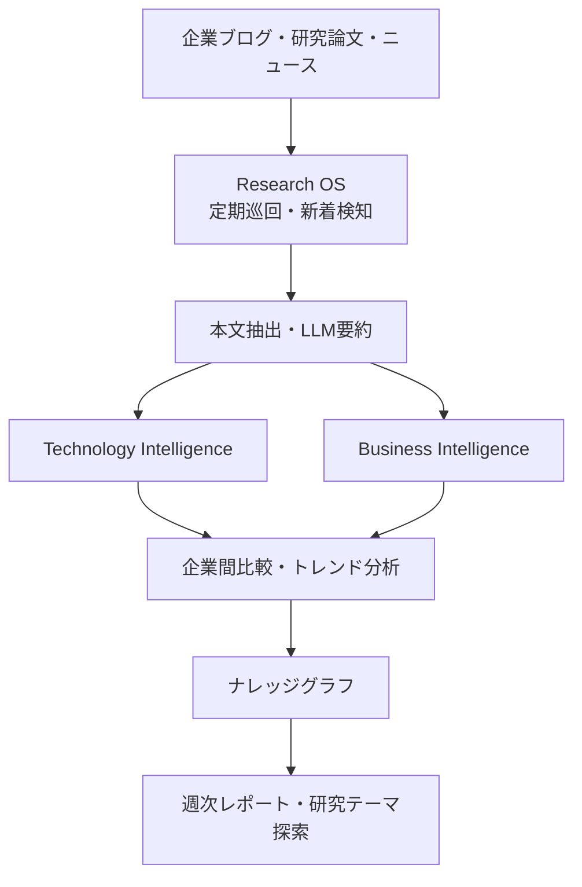
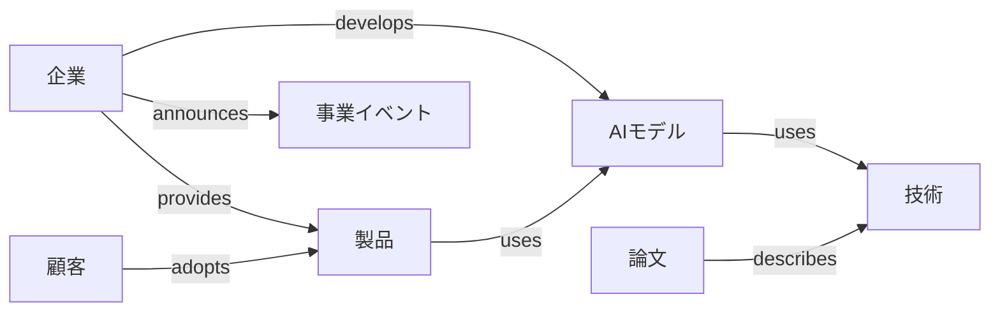

2026-09-21
# 米国フィジカルAI企業・公式ブログ監視リスト

## 目的

Research OSで米国のフィジカルAI企業の公式ブログ、研究論文、ニュースを自動収集・要約し、以下の2つの観点から最新動向を把握する。

1. **Technology Intelligence：技術革新**
   - VLA（Vision-Language-Action）
   - World Model / World Action Model
   - ロボット強化学習・模倣学習
   - Vision-Tactile Learning
   - Agentic Robotics
   - ロボット基盤モデル

2. **Business Intelligence：ビジネスイノベーション**
   - 新製品・新サービス
   - PoCから商用導入への移行
   - ビジネスモデルの変化
   - 新規顧客・提携企業
   - 売上・ARR・ROI
   - 新しい市場・産業への参入

特に、技術的な研究成果がどのように顧客価値や新規事業につながっているのかを把握する。

---

# 1. ロボット基盤モデル・World Model企業

VLA、World Model、汎用ロボット基盤モデルを開発する企業。

修士研究テーマ「Vision-Tactile JEPA World Model for Long-Horizon VLA」との関連性が高い。

| 企業 | 主な技術・製品 | 公式ブログ・ニュース |
|---|---|---|
| Physical Intelligence | πシリーズ、VLA、汎用ロボット学習 | [研究ブログ](https://www.pi.website/) |
| Skild AI | Skild Brain、複数のロボット形態に対応する基盤モデル | [公式ブログ](https://www.skild.ai/blogs) |
| Figure AI | Helix、全身制御VLA、ヒューマノイド | [公式ニュース・研究](https://www.figure.ai/news) |
| World Labs | 3D World Model、空間知能、ロボット向けシミュレーション | [研究ブログ](https://www.worldlabs.ai/blog) |
| 1X Technologies | NEO、動画ベースWorld Model、家庭用ヒューマノイド | [公式記事](https://www.1x.tech/discover) |
| Generalist AI | 汎用ロボット基盤モデル、ロボット操作学習 | [公式サイト](https://generalistai.com/) |

**ビジネス面で注目するポイント**

- AIモデルを外部のロボットメーカーに提供するビジネスモデル
- ロボットメーカーとAI企業の提携
- 汎用基盤モデルによる開発コストの削減
- データ収集基盤の構築
- モデルのAPI提供やライセンス提供
- 実機データからの継続学習

※1X Technologiesはノルウェー創業で、米国にも拠点を持つ企業。厳密な米国発企業とは区別して管理する。

---

# 2. ヒューマノイド・汎用ロボット企業

ヒューマノイドや汎用ロボットを開発し、製造・物流・家庭などへの導入を進める企業。

| 企業 | 主な製品・事業 | 公式情報源 |
|---|---|---|
| Boston Dynamics | Atlas、Spot、Stretch。製造・物流・設備点検 | [公式ブログ](https://bostondynamics.com/blog/) |
| Agility Robotics | Digit。物流・製造向けヒューマノイド | [公式サイト](https://www.agilityrobotics.com/) |
| Apptronik | Apollo。産業向けヒューマノイド | [プレスリリース](https://apptronik.com/company/press-releases) |
| Sunday Robotics | Memo、ACTシリーズ。家庭用ロボット、模倣学習 | [公式ブログ](https://www.sunday.ai/blog) |
| Tesla | Optimus。ヒューマノイド、AI、量産技術 | [AI・ロボティクス](https://www.tesla.com/AI) |

**ビジネス面で注目するポイント**

- 工場や物流施設への実導入
- 実証実験から本番運用への移行
- ロボットの量産体制
- 製造コストの削減
- Robot as a Service（RaaS）
- 人間の作業をどこまで自動化できるか
- ロボットの稼働率・作業成功率
- 導入企業との共同開発

特に、技術デモと顧客現場での継続運用を区別して分析する。

---

# 3. 物流・製造・産業ロボット企業

実際の顧客現場でロボットを運用し、AIの経済的価値を検証している企業。

ビジネスイノベーションの調査では重要な領域。

| 企業 | 主な事業・技術 | 公式情報源 |
|---|---|---|
| Amazon Robotics | 倉庫自動化、Vulcan、触覚、ロボット群の管理 | [Amazon Operations](https://www.aboutamazon.com/news/operations) |
| Dexterity | Foresight World Model、触覚・力制御、物流自動化 | [公式ブログ](https://dexterity.ai/blog) |
| Ambi Robotics | AmbiOS、Agentic Robotics、荷物仕分け・積載 | [公式ブログ](https://www.ambirobotics.com/blog/) |
| Intrinsic | Flowstate、産業用ロボットのAI開発・運用基盤 | [公式ブログ](https://www.intrinsic.ai/blog) |
| FieldAI | 建設現場・産業設備向けの汎用ロボット自律制御 | [公式ブログ](https://www.fieldai.com/blog-archive) |

## 注目企業：Dexterity

World Modelを物流現場に適用する企業。

注目する技術：

- Foresight World Model
- 力覚・触覚を利用したロボット制御
- 物流作業の自動化
- 実環境でのロボット学習

ビジネス面では、FedExとのトラック積載ロボットの展開など、顧客の物流業務にどのように組み込まれているかを追跡する。

## 注目企業：Ambi Robotics

Agentic Roboticsを商用ロボットに適用する企業。

注目する技術：

- AIエージェントによるロボットプログラムの生成
- ロボットの動作改善
- 自動テスト・診断
- Robot Fleet全体への改善策の展開

ビジネス面では、ロボット導入後の保守・改善コストをどの程度削減できるかに注目する。

[Agentic Robotics公式記事](https://www.ambirobotics.com/blog/agentic-robotics/)

---

# 4. 自動運転・自律移動企業

自動運転はロボットマニピュレーションとは対象が異なるが、World Model、Sim2Real、安全性、継続学習などの知見を得られる。

| 企業 | 主な事業・技術 | 公式情報源 |
|---|---|---|
| Waymo | Robotaxi、完全自動運転、商用運行 | [公式ブログ](https://waymo.com/blog/) |
| Nuro | 自動運転基盤モデル、配送・Robotaxi | [公式ブログ](https://www.nuro.ai/blog) |
| Waabi | 自動運転トラック、AIによる運転・シミュレーション | [公式サイト](https://waabi.ai/) |
| Zoox | 専用車両を使ったRobotaxiサービス | [公式サイト](https://zoox.com/) |

※Waabiはカナダ発の企業で、米国にも事業拠点を持つ。

**ビジネス面で注目するポイント**

- 自動運転の商用運行
- サービス提供地域の拡大
- 運行コストの削減
- 自動運転技術のライセンス提供
- 車両メーカーとの提携
- Fleet Management
- 事故率・安全性・運行実績

---

# 5. AI基盤・シミュレーション企業

フィジカルAIの開発環境、シミュレーション、学習基盤を提供する企業・研究組織。

| 企業・組織 | 主な技術 | 公式情報源 |
|---|---|---|
| NVIDIA | Isaac Sim、Isaac Lab、GR00T、Cosmos | [Robotics Blog](https://blogs.nvidia.com/blog/category/robotics/) |
| Google DeepMind | Gemini Robotics、Embodied Reasoning、VLA | [研究ブログ](https://deepmind.google/blog/) |
| World Labs | 空間World Model、生成3D環境、ロボット学習 | [研究ブログ](https://www.worldlabs.ai/blog) |
| Intrinsic | ロボット開発・運用のソフトウェアプラットフォーム | [公式ブログ](https://www.intrinsic.ai/blog) |

Google DeepMindはGoogleの研究組織であり、独立した米国企業ではない。

また、Intrinsicは2026年2月にAlphabet傘下の独立事業からGoogle内の事業に移行した。

Research OSでは企業と研究組織を区別し、技術の開発主体を管理する。

---

# 6. 2026年9月時点で注目したいビジネスイノベーション

## 6.1 Ambi Robotics：AIエージェントによるロボットの自己改善

**発表日：2026年9月17日**

Ambi Roboticsは、Agentic Roboticsを利用して商用ロボットのプログラムを改善する取り組みを発表。

同社によれば、従来はエンジニアが数週間かけて解決していた荷物配置の問題を、AIエージェントが約10時間で解決した。

また、改善策は米国内ロボット群の30%に展開されたとしている。

### 技術面

- Agentic Robotics
- Graph-as-Policy
- ロボットプログラムの自動改善
- 自動テスト・診断
- Robot Fleetへの改善策の展開

### ビジネス面

従来はロボットを導入するだけでなく、その後もエンジニアによる調整・保守が必要だった。

Agentic Roboticsによって改善作業を自動化できれば、ロボットの導入・運用コストを削減できる可能性がある。

注目する事業モデル：

- ロボット導入後の継続的な性能改善
- 自動保守サービス
- Robot Fleet全体の最適化
- 運用改善のサービス化

公式記事：

https://www.ambirobotics.com/blog/agentic-robotics/

---

## 6.2 Skild AI：汎用ロボット基盤モデルの商用化

**発表日：2026年9月10日**

Skild AIは、初の商用導入から10か月で年間経常収益（ARR）が1億ドルを超え、60社以上の有料顧客を獲得したと発表している。

製造、物流、点検、警備などの領域に展開している。

※数値は企業発表に基づく。ARRは実際に認識済みの売上高とは異なる。

### 技術面

- Omni-bodied AI
- VLA
- ロボット基盤モデル
- In-context Learning
- 異なるロボット形態への適用

### ビジネス面

特定のロボット専用AIではなく、複数のロボットに共通して利用できる基盤モデルを提供する。

ロボットメーカーごとにAIを開発する必要性を減らせれば、開発コストや導入期間を削減できる可能性がある。

注目する事業モデル：

- ロボット基盤モデルの提供
- AIモデルのライセンス
- ロボットメーカーとの提携
- 複数産業への横展開

公式記事：

https://www.skild.ai/blogs/skild-crosses-100m-arr

---

## 6.3 Figure AI：家庭環境への汎化とデータ収集基盤

**発表日：2026年9月17日**

Figureは、未経験の30の家庭環境への適応を検証したHelix 2.5を発表した。

また、2026年8月には、人間の行動データを大規模に収集するIndexを公開している。

### 技術面

- Helix
- VLA
- Cross-Embodiment
- Generalization
- Human Data
- ロボットのデータ収集

### ビジネス面

従来のロボットは、導入環境ごとに個別の調整や学習が必要になる場合が多い。

汎化性能を向上できれば、新しい家庭や工場への導入コストを削減できる可能性がある。

注目する事業モデル：

- 家庭用ロボット
- 大規模データ収集基盤
- 汎用ロボットの量産
- 導入先ごとの個別開発コスト削減

公式ニュース：

https://www.figure.ai/news

---

# 7. Research OSでの監視・要約の設計

単に新着記事を要約するだけでなく、技術動向と事業化の動向を別々に抽出する。

## 7.1 全体アーキテクチャ



## 7.2 Technology Intelligence

技術に関する情報を抽出する。

| 分類 | 抽出項目 |
|---|---|
| 技術 | VLA、World Model、RL、触覚、Agentic Robotics |
| モデル | モデル名、アーキテクチャ、入力モダリティ |
| 学習 | 模倣学習、強化学習、自己教師あり学習 |
| 評価 | 成功率、汎化性能、ベンチマーク |
| 論文 | arXiv、学会論文、研究記事 |
| OSS | GitHub、学習済みモデル、データセット |
| 実機 | 対象ロボット、センサー、計算基盤 |

## 7.3 Business Intelligence

ビジネスに関する情報を抽出する。

| 分類 | 抽出項目 |
|---|---|
| 商用化 | PoC、試験導入、正式導入、量産、サービス開始 |
| 顧客 | 導入企業、対象業界、対象業務 |
| 経済性 | 価格、売上、ARR、ROI、導入・運用コスト |
| 実運用 | 稼働時間、成功率、スループット、人間の介入率 |
| 事業戦略 | 提携、M&A、資金調達、新規事業 |
| 事業モデル | API、SaaS、RaaS、ライセンス、ハードウェア販売 |
| 根拠 | 情報源URL、発表日、実施日、第三者検証の有無 |

---

# 8. ナレッジグラフによる企業間比較

Research OSでは、企業・技術・製品・顧客・論文をナレッジグラフとして管理する。

## 8.1 グラフの基本構造



## 8.2 時間・根拠・来歴の管理

企業や技術の関係だけでなく、以下を管理する。

- 発表日
- 実施日
- 情報取得日
- 更新日
- 情報源URL
- 情報の信頼性
- 企業発表か第三者による検証か
- 過去の発表からの変更点

例えば、以下のイベントを区別する。

1. Figureが新しいVLAを発表した。
2. FigureがVLAを実機に統合した。
3. 顧客企業がロボットの試験導入を開始した。
4. 顧客企業が本番運用を開始した。
5. 継続運用の実績が公開された。

これにより、技術発表から事業化までの経緯を追跡できる。

---

# 9. Research OSの監視設定

## 9.1 初期監視対象

最初は以下の企業・組織を監視対象とする。

| 企業・組織 | 主な監視目的 |
|---|---|
| Physical Intelligence | VLA、ロボット基盤モデル |
| Skild AI | 汎用ロボット基盤モデルの商用化 |
| Figure AI | ヒューマノイド、VLA、量産 |
| World Labs | World Model、空間知能 |
| Generalist AI | 汎用ロボット学習 |
| Dexterity | World Model、触覚、物流自動化 |
| Ambi Robotics | Agentic Robotics、商用運用 |
| NVIDIA | GR00T、Cosmos、Isaac |
| Google DeepMind | Gemini Robotics、VLA |

## 9.2 監視頻度

| 処理 | 推奨頻度 |
|---|---|
| 企業ブログの新着確認 | 毎日 |
| 新規論文の確認 | 毎日 |
| GitHubリポジトリの更新確認 | 毎日 |
| 新着記事の要約 | 新着検知時 |
| 企業間の比較分析 | 週1回 |
| 技術・ビジネスのトレンド分析 | 週1回 |
| 過去記事の変更確認 | 定期的 |

既存記事が更新された場合も、変更内容を検知する。

例えば、Amazonが2025年10月に発表したBlue Jayは、その後、2026年2月に運用終了が公表された。

新着記事だけでなく、過去の発表内容の変更を追跡することも重要。

## 9.3 監視設定JSON

Research OSに取り込むための設定例。

```json
{
  "companies": [
    "Physical Intelligence",
    "Skild AI",
    "Figure AI",
    "World Labs",
    "Generalist AI",
    "Dexterity",
    "Ambi Robotics",
    "NVIDIA",
    "Google DeepMind"
  ],
  "check_frequency": "daily",
  "summary_language": "ja",
  "topics": [
    "VLA",
    "World Model",
    "Robot Learning",
    "Agentic Robotics",
    "Commercial Deployment",
    "Business Model"
  ],
  "track_article_updates": true
}
```

※実装時には、企業ごとの公式ブログURL、RSSの有無、記事抽出方法などを追加する。

---

# 10. Research OSで最終的に実現したいこと

Research OSを単なる論文・記事収集ツールではなく、フィジカルAIの技術革新とビジネスイノベーションを継続的に分析するシステムにする。

特に以下の3つを実現する。

### 1. 技術革新の把握

どの企業がどのような技術を開発しているのかを把握する。

例：

- VLAからWorld Action Modelへの発展
- 視覚のみからVision-Tactileへの発展
- 模倣学習と強化学習の統合
- Agentic Roboticsによるロボットの自己改善

### 2. ビジネスイノベーションの把握

どの技術が、どのような顧客価値やビジネスモデルにつながっているのかを分析する。

例：

- ロボット販売からRaaSへの移行
- ロボット基盤モデルのライセンス提供
- Agentic Roboticsによる運用コスト削減
- World Modelによるデータ収集・学習コスト削減

### 3. 新しい研究テーマ・事業機会の発見

企業・技術・顧客・市場の関係をナレッジグラフとして整理し、異なる領域の研究やビジネスの接点を探索する。

最終的には、次の問いに答えられるResearch OSを目指す。

**「フィジカルAIの技術革新は、どのような新しい顧客価値やビジネスモデルを生み出しているのか？」**